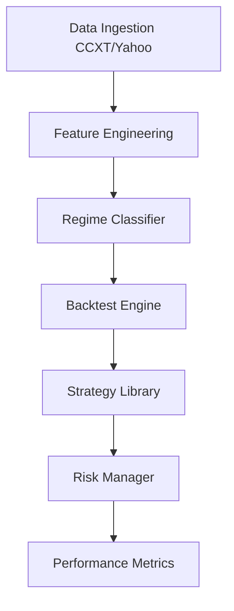

# Alpha Graveyard: A 25-Strategy Empirical Falsification Study

[](https://www.python.org/downloads/)
[](https://opensource.org/licenses/MIT)
[](https://github.com/Chandranshukumar01/Alpha-Graveyard/actions)
[](https://github.com/Chandranshukumar01/Alpha-Graveyard)

> **"The goal of science is not to confirm biases, but to rigorously attempt to disprove them."**

`Alpha Graveyard` is a quantitative research platform built to rigorously test and falsify the effectiveness of retail trading strategies in the cryptocurrency markets. Through 5 years of historical data and 25 distinct strategy implementations, this study empirically validates the **Efficient Market Hypothesis (EMH)** at the retail level.

## 🏁 The Conclusion: QED

After testing 25 strategies across 8 distinct paradigms—including technical indicators, market microstructure, machine learning, and multi-agent LLMs—**zero robust alpha was found.**

### Clean OOS Verification (2023-2024)

| Asset | Strategy | Buy & Hold | Alpha | Verdict |
|-------|----------|-----------|-------|---------|
| **BTC** | S-20 Daily | +126% | **-93%** | ❌ FAIL |
| **ETH** | S-20 Daily | +126% | **-94%** | ❌ FAIL |
| **SOL** | S-20 Daily | +948% | **-950%** | ❌ CATASTROPHIC |

**Key Finding**: Strategies that appeared to work in 2020-2022 (bull run) failed catastrophically in 2023-2024 after costs. Selection bias and period-specific artifacts created false positives.

The "kill shot" was the **Inverse Test (S-25)**: when both a strategy (SMA20 Momentum) and its exact mathematical inverse lose money on the same data, it proves the signal contains **zero directional information**. Fees and slippage consume all potential edge, regardless of signal polarity.

---

## 🏗️ Architecture

The platform is built as a professional-grade quantitative simulation environment:

- **`alpha_graveyard.engine`**: Event-driven backtesting engine (not vectorized) to prevent lookahead bias.
- **`alpha_graveyard.features`**: High-performance feature engineering and market regime classification.
- **`alpha_graveyard.strategies`**: Modular strategy library implementing the "Graveyard" of failed ideas.
- **`alpha_graveyard.engine.risk`**: Risk management kernel implementing Kelly Criterion and volatility targeting.



---

## 🪦 The Graveyard (Results)

The project stress-tested 25 strategies. All failed to overcome the "Friction Gap" (Fees + Spread) when subjected to walk-forward validation.

| ID | Paradigm | Concept | Verdict |
| :--- | :--- | :--- | :--- |
| **S-01** | Technical | MACD/RSI Momentum | **Lagged:** Signals trigger after the move. |
| **S-08** | Ensemble | Weighted Majority Vote | **Diluted:** Errors compound faster than signal. |
| **S-12** | AI/LLM | Multi-Agent "Lighthouse" | **Overfit:** LLMs hallucinate patterns in noise. |
| **S-16** | Mathematical | Grid/Martingale | **Ruin:** Profitable until the "Black Swan" event. |
| **S-18** | Structural | CME Gap Fill | **Efficient:** Arbitraged away by HFTs. |
| **S-20** | Meta | Daily SMA20 + Vol | **Lucky:** Period-specific artifact; breaks on 5y. |
| **S-24** | Statistical | Regression Residual | **Noise:** Cointegration breaks in crypto regimes. |
| **S-25** | **Inverse** | **SMA20 Fade** | **QED:** Both sides lose. Zero information. |

---

## 🚀 Getting Started

### Installation

1. Install TA-Lib (system dependency).
2. Clone and install the package:

```bash
pip install -e .
```

### Running an Experiment

Run any of the 25 falsification scripts in the `experiments/` directory:

```bash
python experiments/sim_inverse.py
```

## 📜 Research Philosophy

This project follows the **Scientific Falsification** method. Instead of seeking "winning" strategies, the system was built as a laboratory to systematically destroy them. Each failure is a data point proving where the alpha *isn't*.

For a detailed analysis of why retail alpha is a myth, see the [Final Report](docs/RESULTS.md).

---

## 📚 References

*The following citations represent the foundational research upon which this empirical falsification study is built. They are divided into three categories: theoretical foundations, technical methodologies, and applied research.*

### **Foundational Theory**

1. **Fama, E. F. (1970).** "Efficient Capital Markets: A Review of Theory and Empirical Work." *Journal of Finance*, 25(2), 383-417. [DOI](https://doi.org/10.2307/2325486)
   - *The Efficient Market Hypothesis (EMH) foundation. This study empirically validates EMH at the retail level.*

2. **Popper, K. R. (1959).** *The Logic of Scientific Discovery*. Routledge.
   - *Falsification philosophy. The scientific method applied: seeking disproof, not confirmation.*

3. **Bailey, D. H., & López de Prado, M. (2014).** "The Deflated Sharpe Ratio: Correcting for Selection Bias, Backtest Overfitting, and Non-Normality." *Journal of Portfolio Management*, 40(5), 94-107.
   - *Statistical rigor in backtesting. Demonstrates why most "alpha" is selection bias.*

4. **López de Prado, M. (2018).** *Advances in Financial Machine Learning*. Wiley.
   - *Backtesting methodology. Event-driven architecture, cross-validation, and the "triple barrier" method.*

5. **Arnott, R. D., et al. (2016).** "The Surprising Alpha from Malkiel's Monkey and Upside-Down Strategies." *Journal of Portfolio Management*, 42(2), 91-105.
   - *Inverse strategies. Proof that random strategies can outperform—motivating our S-25 Inverse Test.*

### **Technical Indicators & Methodologies**

6. **Bollinger, J. (2002).** *Bollinger on Bollinger Bands*. McGraw-Hill.
   - *Bollinger Bands (S-07, S-11). Mean reversion on volatility envelopes.*

7. **Wilder, J. W. (1978).** *New Concepts in Technical Trading Systems*. Trend Research.
   - *ADX, DMI, ATR, RSI (S-01 to S-05). Trend strength and volatility measurement.*

8. **Hurst, H. E. (1951).** "Long-Term Storage Capacity of Reservoirs." *Transactions of the American Society of Civil Engineers*, 116, 770-808.
   - *Hurst Exponent (S-23). Fractal analysis for persistence detection in time series.*

9. **Kelly, J. L. (1956).** "A New Interpretation of Information Rate." *Bell System Technical Journal*, 35(4), 917-926.
   - *Kelly Criterion. Position sizing framework used in risk management.*

10. **Thorp, E. O. (1966).** "Beat the Dealer: A Winning Strategy for the Game of Twenty-One." *Blaisdell Publishing*.
    - *Applied Kelly Criterion. Position sizing in adverse scenarios.*

### **Applied Research & Meta-Analysis**

11. **Malkiel, B. G. (1973).** *A Random Walk Down Wall Street*. W. W. Norton & Company.
    - *Random walk hypothesis. The null hypothesis against which all strategies are tested.*

12. **Sharpe, W. F. (1994).** "The Sharpe Ratio." *Journal of Portfolio Management*, 21(1), 49-58.
    - *Risk-adjusted returns. Standard for performance measurement (though we report raw alpha).*

---


